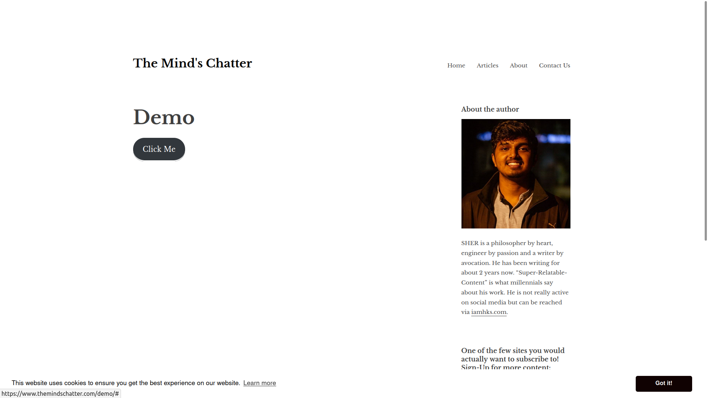
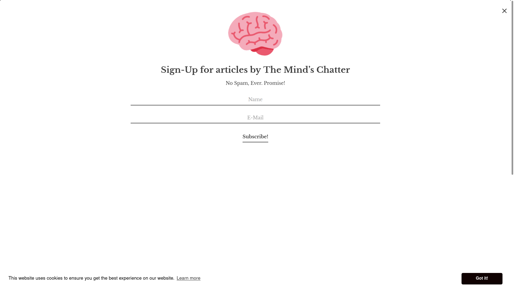

# Sign-Up-Form-using-API

I was in need of a pop-up Sign-Up form for my website and made this project was made to serve that purpose. I used API provided by the email marketing software Sendinblue. For easy understanding I have divided this write up into sections, feel free to skip the one's you're already confident in:

1) [Basics](#Basics)
2) [Coding](#Coding)
3) [Setting it up](#Setting-it-up)

## Basics
API stands for Application Programming Interface which in simple terms bridges the communication between two applications. In this project we're using the API of Sendinblue to connect it to our website to display a pop-up form whenever the user reaches the middle of the page or when the user is about to exit. 


## Coding

### Front-End
This code generates a modal popup form. Although the css and class for the Click Here button is not present here in the code because I preferred to make use WordPress's button class instead of defining another css for the same.
```
		<style type="text/css">
			
			.bg-modal {
				background-color: rgba(0, 0, 0, 0.8);
				width: 100%;
				height: 100%;
				position: fixed;
				top: 0;
				left: 0;
				display: none;
				justify-content: center;
				align-items: center;
			}
			
			.modal-contents {
				height: 60%;
				width: 30%;
				background-color: white;
				text-align: center;
				padding: 20px;
				position: relative;
				border-radius: 4px;
			}
			
			input {
				margin-top: 25px; margin-left: 25%;
				display: block;
				width: 50%;
				padding: 8px;
				border: 1px solid white;
			}
			
			.close {
				position: absolute;
				top: 0;
				right: 10px;
				font-size: 42px;
				color: #333;
				transform: rotate(45deg);
				cursor: pointer;
			}
		
			</style>
	<a href="#" id="button" class="button">Click Me</a>	
  
	<div class="bg-modal">
		<div class="modal-contents">
	
			<div class="close">+</div>
			
			<h2> Sign-Up for articles by The Mind's Chatter</h2>
			No Spam, Ever. Promise!
			<form action="" method="get">
				<input type="text" placeholder="Name">
				<input type="email" placeholder="E-Mail"><br>
				<!--<input class="button" type="submit" id="SendButton" name="submit" value="Submit" />
				<a href="#" class="button">Subscirbe!</a>-->
				<button type="submit" id="btn-submit">Subscribe!</button>
			</form>
	
		</div>
	</div>
	

<script type="text/javascript">
document.getElementById('button').addEventListener("click", function() {
	document.querySelector('.bg-modal').style.display = "flex";
});

document.querySelector('.close').addEventListener("click", function() {
	document.querySelector('.bg-modal').style.display = "none";
});	</script>		
```
Shown below is the button created which when click makes a full screen popup. We are preferring a full screen popup because it is easier to scale on mobile devices too.

Shown below is the output of the popup.


### Back-End

## Setting it up
